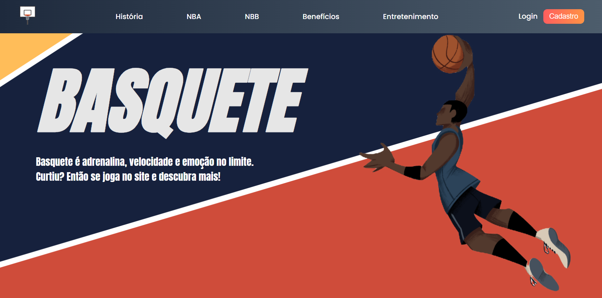
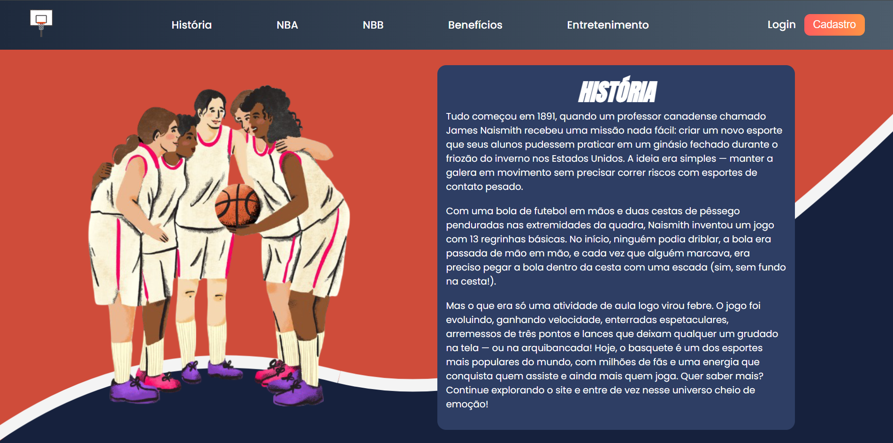
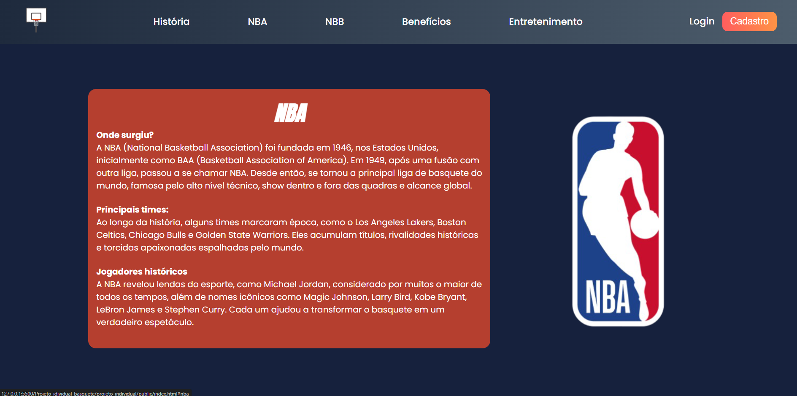
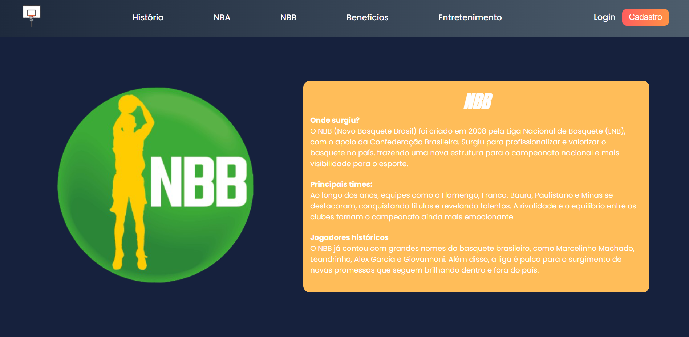
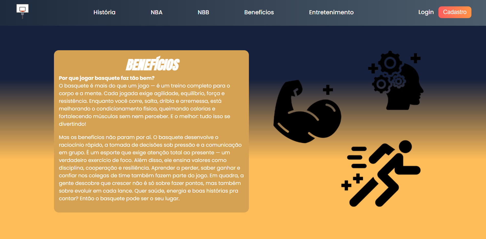
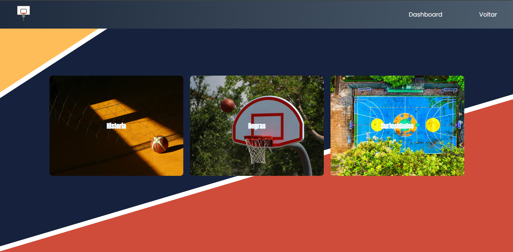
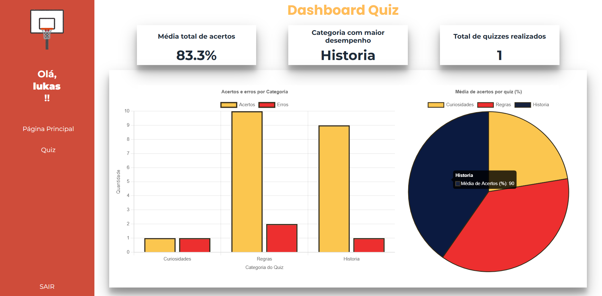

#  Projeto Individual
Este é o meu projeto individual. Será utilizado HTML, CSS, JAVASCRIPT e API's em sua composição.

 

##  Sobre

Este projeto é um site informativo e interativo sobre basquete. A proposta principal é educar e entreter os usuários com conteúdos sobre a história do basquete, NBA, NBB, benefícios do esporte e curiosidades.
Este é um site feito com carinho para quem ama basquete ou quer conhecer mais sobre esse esporte cheio de energia, história e emoção. Aqui, você encontra informações e curiosidades sobre o mundo do basquete além de ter acesso aos quizzes e verificar seu desempenho ao final com a dashboard criada, de forma simples e fácil de navegar.
### Imagens do Site 

    

    

    

    

    

    

    

    

## 🏀 Público-alvo

- Amantes de basquete
- Estudantes interessados
- Curiosos

## 🛠️ Tecnologias Utilizadas

